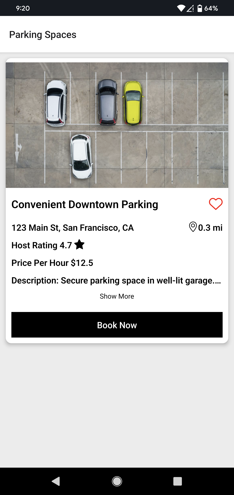
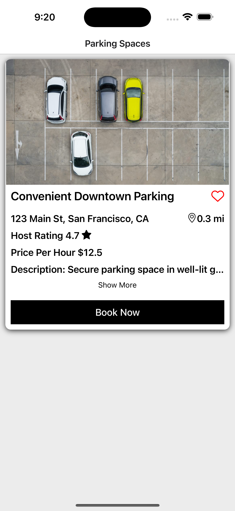

# Introduction
This sample project was built with React Native, Expo, and Typescript.

# Getting Started
Expo Go is needed to test the app so make sure to download it from the App Store or Google Play.
1. Clone project
2. cd into project
3. npm install
4. npx expo start
5. Once the server is running, open Expo Go on your device and scan the QR code. If you are using a simulator, press "i" to open iOS or press "a" to open Android.

# My approach
I decided to create this project with Expo so I could get it up and running quickly. Since the app doesn't do any api calls, I created a timeout to simulate an api call. Normally, I would use Redux to handle the state of the app but since this app is one screen, I used the useState hook.
I used TypeScript since it helps identify any errors that may occur and defines the data types.
For the components, I built them from scratch and didn't install any third party libraries. 

# Screenshots

